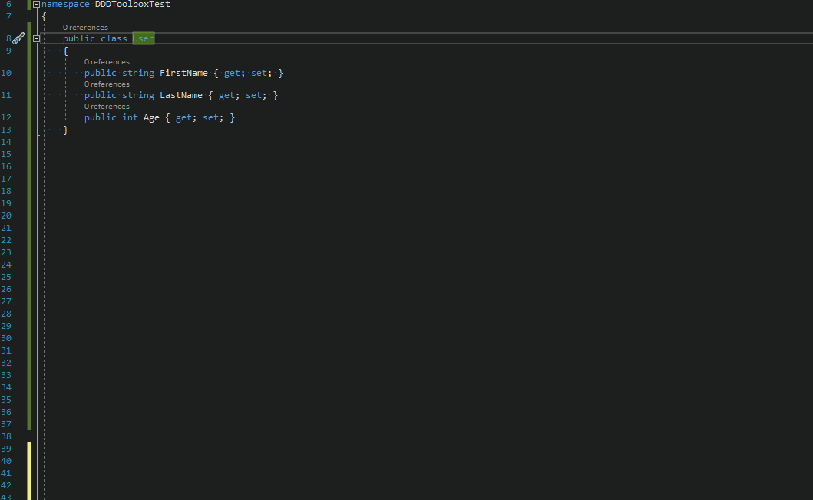

# DDDToolbox
A set of Roslyn refactorings supporting DDD design

Extension available at Visual Studio Marketpalace [here](https://marketplace.visualstudio.com/items?itemName=54748ff9-45fc-43c2-8ec5-cf7912bc3b84.DDToolbox)

## Features

Currently implemented refactorings:
 - make class readonly
 - add structural equality
 - add comparison operators
 - converty type to record
 

